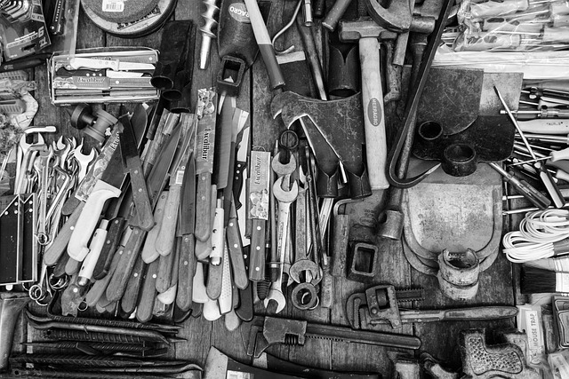

\

# mytools

<!-- badges: start -->

<!-- badges: end -->

The goal of mytools is to ...

## Installation

You can install the development version of mytools like so:

``` r
install.packages("mytools")
```

## Example

This is a basic example which shows you how to solve a common problem:

``` r
library(mytools)
qscatter(mtcars,wt,hp)
stats(mtcars,mpg,am)
```
